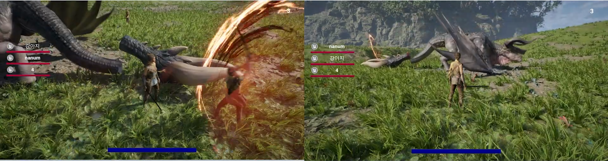

# 🐉 프로젝트 와이번테일

**몬스터 헌터 스타일의 3인칭 액션 게임, 싱글·멀티 플레이 지원**
- (클릭하면 유튜브영상으로 이동합니다.)

## 프로젝트 소개
- **목표**: Monster Hunter 스타일의 액션 전투 체험 제공  
- **플랫폼**: Unreal Engine 5.5 (PC)  
- **모드**:  
  - 싱글플레이: AI 몬스터, 카메라 셰이크, 페이즈별 로직
  - 멀티플레이:
    - TCP 기반 로그인 / 데디케이티드 서버 통신
    - Player/Monster 동기화
    - GameState, GameMode 분리

## 주요 기능

### 1차 싱글 콘텐츠
- 게임플레이  
  - 몬스터 AI (패트롤, 추적→공격 전환, Dead 처리)  
  - 몬스터 꼬리 절단, 약점 부위에 따른 Hit처리 분기
  - 플레이어 공격(콤보, 대시 어택, 애니메이션 블렌딩)
  - 플레이어 및 몬스터 피격 시 넉백 처리
  - 카메라 Shake, UI HP 바, 포탈 연출  
  - 락온(타겟팅 뷰)모드

---

### C++ 전환
- 핵심 클래스로 전환  
  - `GameMode`, `PlayerController`, `EchoCharacter → PlayerCharacter`  
  - `Weapon`, `TargetSystem (lock‐on)`, `DashAttack`, `Portal`  
- RPC & 멀티플레이용 리팩토링 진행 중  

---

### 2차 멀티플레이
- 네트워킹  
  - TCP 로그인 서버
      - 역할       : UE5 클라이언트 ↔ MySQL 인증 / UE5 Dedicated Server 연결 중계
    - 언어       : C++
    - DB         : MySQL 8.x  + Connector/C++ 8.x
    - Networking : WinSock (Blocking) — 1 스레드 당 1 클라
    - Protocol   : FlatBuffers (4B Length-Prefix)
  - Dedicated Server 환경 구성  

- 동기화 작업
  - 플레이어 위치/애니메이션/대미지 동기화  
  - 몬스터 AI 동기화 및 대미지 처리
  - 포탈 사용 동기화
  - 참여 플레이어 리스트 UI 추가

 

## 기술 스택
- **엔진**: Unreal Engine 5.5  
- **언어**: C++, Blueprints  
- **네트워크**: Winsock2 기반 TCP 서버, Dedicated 서버 
- **도구**: Git, Sourcetree, Notion, Discord  

 

## 팀원 & 역할

| 팀원                         | 주요 역할 & 담당 영역                                                                                                                                          |
|----------------------------|-------------------------------------------------------------------------------------------------------------------------------------------------------------|
| **구서경(kuskbee)**      | - **플레이어 캐릭터**: 대시공격 및 상태별 애니메이션 블렌딩 및 C++ 전환 작업 - **포탈/제단 기믹** : 몬스터 꼬리를 이용한 포탈 오픈 기믹 및 멀티 동기화 작업 - **락온모드 추가** : 근처 몬스터를 대상으로 카메라뷰 타겟팅 - **Dedicated Server** : 환경 구축 및 운영 - **TCP 로그인 서버** ↔ MySQL 인증 중계 (Connector/C++ 사용)   - **네트워크 클라이언트**: UE5 ↔ TCP 로그인 서버 통신    - **프로토콜 연동**: FlatBuffers 메시징         |
| **문한준(nanumoon)**                | - **몬스터 블루프린트 작업** : 공격, 페이즈 별 스킬 & 스탯 변환  &nbsp;&nbsp;&nbsp;&nbsp;- 꼬리자르기, 부위별 대미지 구분  &nbsp;&nbsp;&nbsp;&nbsp;- 몬스터 AI 패트롤·추적 → 공격 전환·HitReact·죽음 처리   - **GameState / GameMode** 설계·구현          - **멀티 동기화**: 플레이어 캐릭터 위치/애니메이션/대미지   - **UI C++ 전환 작업** :  HUD, HudWidget - **UI 멀티 작업**: 플레이어 HP 바,  Game Lose/Win UI 표시                  |
| **오태형(dhxogud)**    | - **몬스터 캐릭터 블루프린트 소스 → C++ 전환 작업**     &nbsp;&nbsp;&nbsp;&nbsp;- **AI & State 설계**: Behavior Tree 및 Blackboard 기반 Patrol·Chase·Battle·Die 상태 정의 &nbsp;&nbsp;&nbsp;&nbsp;- **Status Manager Component**: HP, Damage 처리 로직 구현     &nbsp;&nbsp;&nbsp;&nbsp;- **애니메이션**: Move, Attack, Hit, Die, Run 애니메이션 블렌딩     &nbsp;&nbsp;&nbsp;&nbsp;- **페이즈 분할 및 상태 전환**: 몬스터 페이즈별 로직 분리·전환 구현 &nbsp;&nbsp;&nbsp;&nbsp;- **꼬리 절단 기능 구현**: 몬스터 꼬리 절단 및 후처리 로직 -  **몬스터 타겟팅 전환 로직** : 공격모션이 끝날 때마다 타겟 전환되도록 C++ BT Service, Task 구현  - **네트워크 동기화**: 서버-클라이언트 간 몬스터 캐릭터 동기화 및 작업 |
| **강채림(rim014)**    | - **리소스·레벨 디자인**: 인게임 자연 및 우주 컨셉 맵·에셋 구성 - **VFX & 이펙트**: 포탈, 제단 이펙트 및 검기, 피격 이펙트 제작 - **UI 리소스**: 몬스터 HP 및 Game Lose/Win UI 디자인 및 구현                           |

---
 
 
프로젝트에 사용된 에셋과 리소스들은 순수히 학습 및 비상업적 용도를 위해 사용된 것이며, 원저작권자의 권리를 침해하거나 상업적 이익을 추구할 의도가 없음을 밝힙니다.